# Tugas Praktikum 5 (Pertemuan ke 12) 


# SQL Join

## •  Membuat Table Mahasiswa
```sql
CREATE TABLE Dosen (
    kd_ds VARCHAR(10) PRIMARY KEY NOT NULL,
    nama VARCHAR(50) NOT NULL
);
```

```sql
INSERT INTO Dosen VALUES
('DS001', 'Nofal Arianto'),
('DS002', 'Ario Talib'),
('DS003', 'Ayu Rahmadina'),
('DS004', 'Ratna Kumala'),
('DS005', 'Vika Prasetyo');
```

### Outputnya :

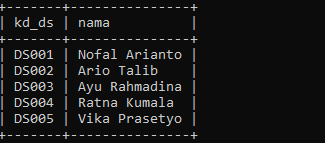

## •  Membuat Table Dosen 
```sql
CREATE TABLE mahasiswa (
    nim INT PRIMARY KEY NOT NULL,
    nama VARCHAR(50) NOT NULL,
    jk ENUM('L', 'P'),
    tgl_lahir DATE,
    jalan VARCHAR(50),
    kota VARCHAR(25),
    kodepos INT,
    no_hp INT,
    kd_ds VARCHAR(10),
    FOREIGN KEY (kd_ds) REFERENCES Dosen(kd_ds)
);
```

```sql
INSERT INTO mahasiswa VALUES
(1812345, 'Ari Santoso', 'L', '1999-10-11', NULL, 'Bekasi', NULL, NULL, 'DS002'),
(1823456, 'Dina Marlina', 'P', '1998-11-20', NULL, 'Jakarta', NULL, NULL, NULL),
(1834567, 'Rahmat Hidayat', 'L', '1999-05-10', NULL, 'Bekasi', NULL, NULL, NULL),
(1845678, 'Jaka Sampurna', 'L', '2000-10-19', NULL, 'Cikarang', NULL, NULL, NULL),
(1856789, 'Tia Lestari', 'P', '1999-02-15', NULL, 'Karawang', NULL, NULL, NULL),
(1867890, 'Anton Sinaga', 'L', '1998-06-22', NULL, 'Bekasi', NULL, NULL, NULL),
(1912345, 'Listia Nastiti', 'P', '2001-10-23', NULL, 'Jakarta', NULL, NULL, NULL),
(1923456, 'Amira Jarisa', 'P', '2001-01-24', NULL, 'Karawang', NULL, NULL, 'DS004'),
(1934567, 'Laksana Mardito', 'L', '1999-04-14', NULL, 'Cikarang', NULL, NULL, NULL),
(1945678, 'Jura Marsina', 'P', '2000-05-10', NULL, 'Cikarang', NULL, NULL, NULL),
(1956789, 'Dadi Martani', 'L', '2001-08-29', NULL, 'Bekasi', NULL, NULL, 'DS005'),
(1967890, 'Bayu Laksono', 'L', '1999-07-22', NULL, 'Cikarang', NULL, NULL, 'DS004');
```

### Outputnya :

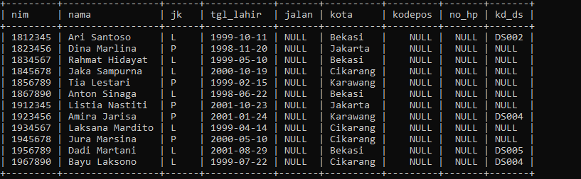

## • Membuat Tabel Matakuliah
```sql
CREATE TABLE matakuliah (
    kd_mk VARCHAR(10) PRIMARY KEY NOT NULL,
    nama VARCHAR(50) NOT NULL,
    sks INT
);
```

```sql
INSERT INTO MataKuliah VALUES
('MK001', 'Algoritma Dan Pemrograman', 3),
('MK002', 'Praktikum Algoritma Dan Pemrograman', 1),
('MK003', 'Teknologi Basis Data', 3),
('MK004', 'Praktikum Teknologi Basis Data', 1),
('MK005', 'Pemrograman Dasar', 3),
('MK006', 'Pergraman Berorientasi Objek', 3),
('MK007', 'Struktur Data', 3),
('MK008', 'Arsitektur Komputer', 2);
```

### Outputnya :

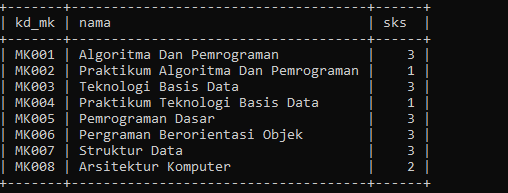

## •  Membuat Table Jadwal Mengajar
```sql
CREATE TABLE JadwalMengajar (
    kd_mk VARCHAR(10),
    kd_ds VARCHAR(10),
    hari VARCHAR(10),
    jam TIME,
    ruang VARCHAR(10),
    PRIMARY KEY (kd_mk, kd_ds, hari, jam),
    FOREIGN KEY (kd_ds) REFERENCES Dosen(kd_ds),
    FOREIGN KEY (kd_mk) REFERENCES Matakuliah(kd_mk)
);
```

```sql
INSERT INTO JadwalMengajar VALUES
('MK001', 'DS002', 'Senin', '10:00:00', '102'),
('MK002', 'DS002', 'Senin', '13:00:00', 'Lab. 01'),
('MK003', 'DS001', 'Selasa', '08:00:00', '201'),
('MK004', 'DS001', 'Rabu', '10:00:00', 'Lab. 02'),
('MK005', 'DS003', 'Selasa', '10:00:00', 'Lab. 01'),
('MK006', 'DS004', 'Kamis', '09:00:00', 'Lab. 03'),
('MK007', 'DS005', 'Rabu', '08:00:00', '102'),
('MK008', 'DS005', 'Kamis', '13:00:00', '201');
```

### Outputnya :

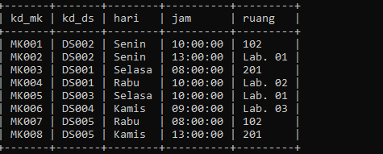

## •  Membuat Table Krs Mahasiswa
```sql
CREATE TABLE KRSMahasiswa (
    nim INT,
    kd_mk VARCHAR(10),
    kd_ds VARCHAR(10),
    semester CHAR(1),
    nilai FLOAT,
    PRIMARY KEY (nim, kd_mk, kd_ds),
    FOREIGN KEY (nim) REFERENCES Mahasiswa(nim),
    FOREIGN KEY (kd_mk) REFERENCES Matakuliah(kd_mk),
    FOREIGN KEY (kd_ds) REFERENCES Dosen(kd_ds)
);
```

```sql
INSERT INTO KRSMahasiswa VALUES 
(1823456, 'MK001', 'DS002', 3, NULL),
(1823456, 'MK002', 'DS002', 1, NULL),
(1823456, 'MK003', 'DS001', 3, NULL),
(1823456, 'MK004', 'DS001', 3, NULL),
(1823456, 'MK007', 'DS005', 3, NULL),
(1823456, 'MK008', 'DS005', 3, NULL);
```

### Outputnya :

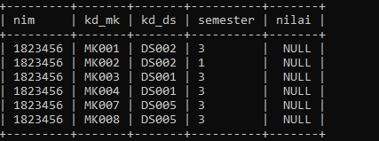

# Latihan !!

## • Lakukan join table Mahasiswa dan Dosen
```sql
SELECT
mahasiswa.nim,
mahasiswa.nama,
mahasiswa.jk,
dosen.nama AS "Dosen Pengampu"
FROM mahasiswa
JOIN dosen ON mahasiswa.kd_ds = dosen.kd_ds;
```

### Outputnya :

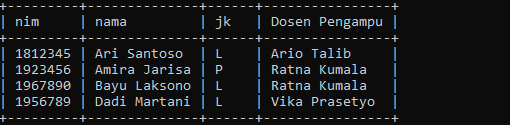

## • Lakukan join tabel Matakuliah dan Dosen
```sql
SELECT * FROM Matakuliah
JOIN dosen ON matakuliah.kd_ds = dosen.kd_ds;
```

### Outputnya :


```
Note: Terjadi error karena tidak ada relasi antara kedua tabel. tabel dosen memiliki kolom kd_ds sementara tabel matakuliah tidak. table matakuliah memiliki kolom kd_mk sementara tabel dosen tidak.  Tidak ada Foreign Key yang sama sehingga tidak bisa saling berelasi/JOIN. 
```

## • Lakukan join table JadwalMengajar, Dosen, dan Matakuluan
```sql
SELECT
matakuliah.kd_mk,
matakuliah.nama AS 'Mata Kuliah',
matakuliah.sks,
dosen.kd_ds,
dosen.nama AS 'Dosen Pengampu' JadwalMengajar.hari, JadwalMengajar.jam, JadwalMengajar.ruang
FROM matakuliah
JOIN jadwalmengajar ON matakuliah.kd_mk = jadwalmengajar.kd_mk
JOIN dosen ON jadwalmengajar.kd_ds = dosen.kd_ds;
```

### Outputnya :

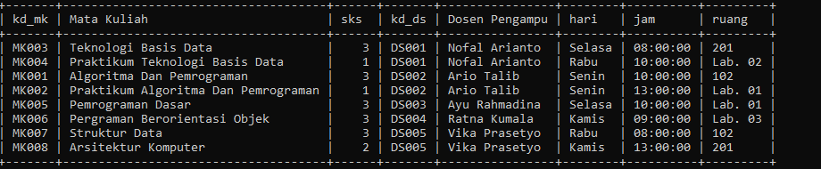


## • Lakukan join tabel KrsMahasiswa, Mahasiswa, Matakuliah, dan Dosen
```sql
SELECT 
krsmahasiswa.nim,
mahasiswa.nama,
dosen.nama AS 'Dosen PA',
matakuliah.nama AS 'Mata Kuliah',
mataKuliah.sks,
dosen.nama AS 'Dosen Pengampu'
FROM krsmahasiswa
JOIN mahasiswa ON krsmahasiswa.nim = mahasiswa.nim
JOIN matakuliah ON krsmahasiswa.kd_mk = matakuliah.kd_mk
JOIN dosen ON krsmahasiswa.kd_ds = dosen.kd_ds;
```

### Outputnya :

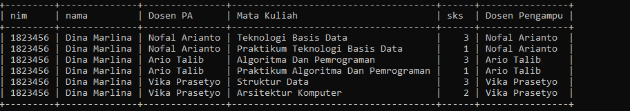


# Hanya Output Table-Table nya saja !!

## JOIN table Mahasiswa dan Dosen

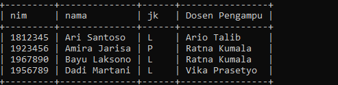

## LEFT JOIN table Mahasiswa dan Dosen

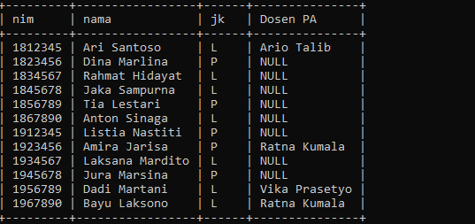

## JOIN table JadwalMengajar, Dosen, dan Matakuluan

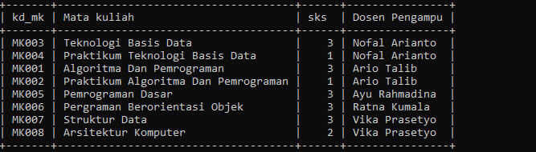

## JOIN table JadwalMengajar, Dosen, dan Matakuluan


## JOIN tabel KrsMahasiswa, Mahasiswa, Matakuliah, dan Dosen


